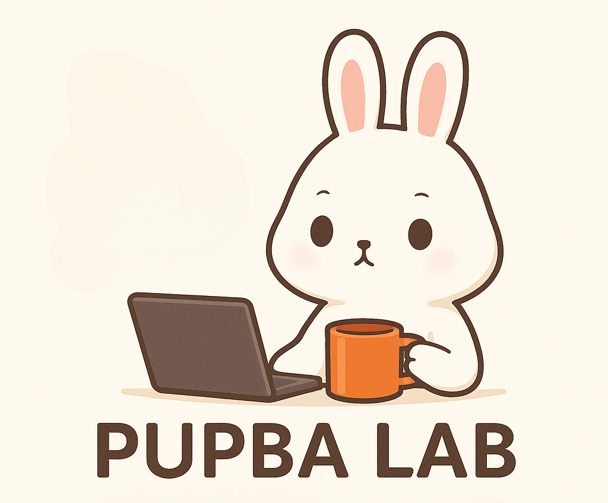

  

    
  

👋 Welcome to Pupba Lab

  Exploring AI Pipelines, MLOps, and Open Source🐇✨  

---

## 🐇 About Me

Hi! I'm **Gwangwon Jung**,  
a Vision AI & Generative AI engineer at **StudioM**.

My main areas of interest include:

- 🖼️ Image, Video generation and processing  
- 🧠 Large Language Models (LLMs)  
- 👁️ Computer Vision  
- 🛠️ MLOps and pipeline automation  

---

## 🔭 Featured Projects

### [LangChain-OpenTutorial](https://github.com/pupba/LangChain-OpenTutorial)

An open tutorial built with LangChain and LangGraph, designed for hands-on learning via Jupyter Notebooks.  
I contributed to the **VectorStore** module, including the base tutorial templates and integrations with **Chroma** and **Qdrant**.  
More contributions are planned in the future!

### [Comfy_ForEach](https://github.com/pupba/Comfy_ForEach)

A custom node for **ComfyUI** designed to support batch-based processing within workflows.  
It enables users to iterate over input lists during generation and can be deployed on **AWS**, where it integrates with **EventBridge** to handle batch-completion or error notifications.

---

## 📽️ [Bunnys Slider](https://pupba.github.io/pupba-slider/)

---

## 🤝 Contact

- 📧 Email: [rhdk5148@gmail.com](mailto:rhdk5148@gmail.com)  
- 🌐 Blog: [https://pupbani.tistory.com/](https://pupbani.tistory.com/)  
- 💼 LinkedIn: [https://www.linkedin.com/in/gwangwon-jung-5287a7275](https://www.linkedin.com/in/gwangwon-jung-5287a7275)

---

  Built with ❤️ by Gwangwon Jung | Powered by Open Source

